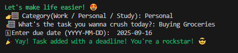
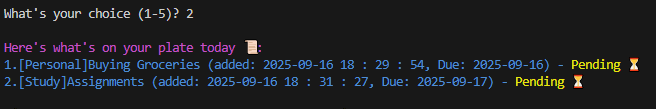
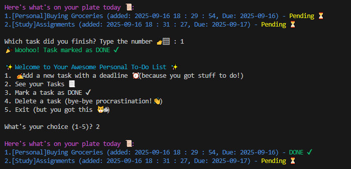

# 🎯 My Awesome To-Do List App

A simple, fun, and human-friendly To-Do List app built with Python

## 🔸 Features
- Add tasks with categories (Work / Personal / study) 📃
- Set due dates for tasks 📅
- View tasks with clear status (✔ Done / ⏳ Pending / ⚠ Overdue)
- Mark tasks as done or delete them
- Colorful console output using Colorama 🎨

## 📸 Screenshots

### Adding a New Task

----

### Viewing your tasks

----

### Marking a task as done

## How to Run 💻
1. Install dependencies:
    python todo_app.py
    pip install colorama
2. Run the app